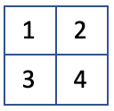

## 题目：猜数字

游戏有四个格子，每个格子有一个数字（范围:0~9），任意两个格子的数字都不一样。你有6次猜测的机会，如果猜对则获胜，否则失败。每次猜测时需依序输入4个数字，程序会根据猜测的情况给出xAxB的反馈，A前面的数字代表位置和数字都对的个数，B前面的数字代表数字对但是位置不对的个数。

例如：上图是1 2 3 4， 那么对于不同的输入，有如下的输出

| 输入     |  输出 |    说明                |
|---------|:-----:|----------------------:|
| 1 5 6 7 |  1A0B | 1位置正确              |
| 2 4 7 8 |  0A2B | 2和4位置都不正确        |
| 0 3 2 4 |  1A2B | 4位置正确，2和3位置不正确|
| 5 6 7 8 |  0A0B | 没有任何一个数字正确     |
| 4 3 2 1 |  0A4B | 4个数字位置都不对       |
| 1 2 3 4 |  4A0B | 胜出 全中              |
| 1 1 2 3 | 输入不正确，重新输入 |           |
| 1 2     | 输入不正确，重新输入 |           |

* 答案是在游戏开始时预先随机生成，且不可改变的。
* 每一局只有6次猜测机会。
* 每一次玩家输入前，都打印提示语。
* 每一次玩家输入猜测结果之后，程序自动打印出前面所有猜测过的数字和判断结果。
* 当猜测正确时，打印“You win!”及最后一次猜测结果。并结束游戏。
* 每次猜测的输入界面为控制台（Console），以避免太多与问题无关的界面代码。
* 输入时，用单个空格分隔每个数字。