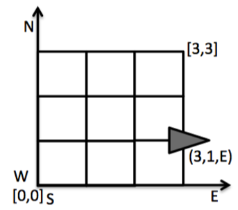

## 说明

* 限时2天完成
* 可以选用擅长的语言完成，例如 C、C++、Java、C#、Javascript、Python、Scala 等
* 可以使用第三方库简化代码(如日期，时间、集合操作等)
* 代码的输入和输出必须和题目的测试用例输出严格一致
* 代码完成后必须附上 Readme 纯文本文档(推荐使用 markdown 排版)
* Readme 文档中应描述如何运行单元测试或主程序来证明题目的正确性(至少针对测试用例输入能够得到对应输出)

## 题目内容

在火星的某个位置，新发现了一个高原区域。为了探测这块区域，NASA(美国国家航空 航天局)将向该区域发送一小队火星探测车(Mars Rover)。它们将探测区域各方向的详细边界位置。其上安装的发送器会将这些数据发送回地球。

经过初步探测后，NASA 发现，这个火星高原是个矩形。于是，这个高原被划分成一个网格，并将该区域的左下 角作为原点(如下图)。NASA 将为每个火星探测车设定一个初始位置 (由一个坐标点 x,y 表示)和朝向(由四个方向的首字母 N，S，W，E 表示)。例如 0 0 N 表示探测车在原点，面向北放置。关于朝向的定义是：从点(x, y)向(x, y+1)的矢量方向为北(North)。




为了控制探测车移动， NASA 将向其发送一个由‘'L', 'R'和'M'组成的字串。 'L'让车原地左转 90 度，而 'R'则原地向右转 90 度。'M'是在原朝向上，向前移动一格。

NASA 对火星车有一个新设计，当它移动越过高原边界时，它就会掉落深渊。当探测车失足时，它会留下一个信号灯，阻止后来的探测车在同一地点掉下去。当后来的探测车到达同一地点时，如果当前指令是向失足方向移动时，它会忽略该指令，而 继续执行下一个指令。

而当火星车失足时，它会发出"RIP"信息，并被打印在其最后的坐标点和朝向之后。

*注意:控制中心一次接收到所有命令后，每次只放出一个探测车。当前一辆探测车运行完。或失足后，下一辆才出发。*

### 程序输入: 

程序首先会得到一行输入，指定高原的大小，由两个数字组成，数字间为空格分隔(可能多个)。

之后是对每个火星车发出的指令。每个火星车会得到两行输入。第一行是指定它的位置，第二行是一系列指令，告诉火星车如何移动来探测这个高原。

位置(第一行)由两个整数和一个字符组成，由空格分隔(可能多个)，分别对应探测车 的 x 坐标和 y 坐标，以及它的朝向。如果位置无法解析，程序要求重新输入新的位置。
指令(第二行)由 L,R,M 三个字母的任意组合组成。 

每个探测车按顺序完成任务的，也就是说，只有第一个车完成移动后，第二个车才会开始行动。

例如，当程序输入顺序如下如示时：

```
55
12 N 
LMLMLMLMM
33 E
MMM
```

程序输出应该为：

```
13 N
5 3 E RIP
```

